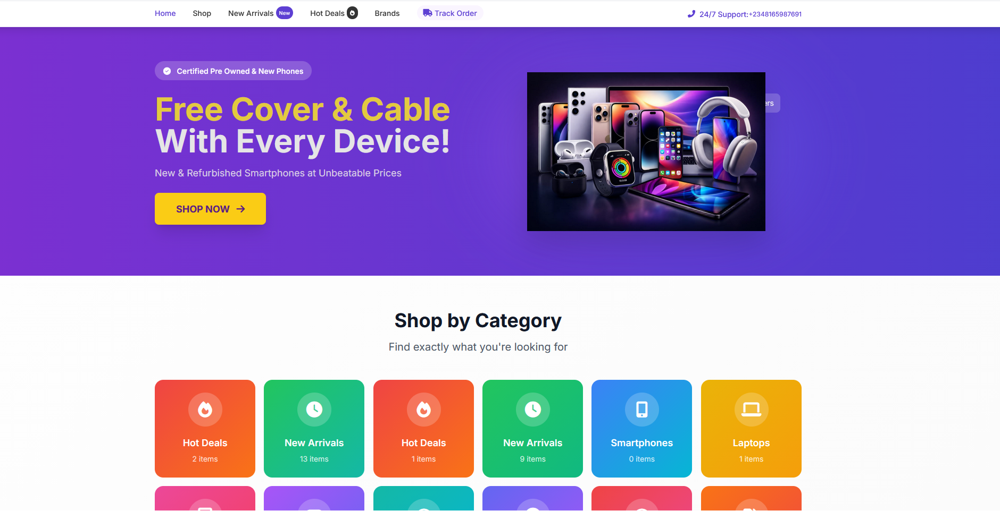
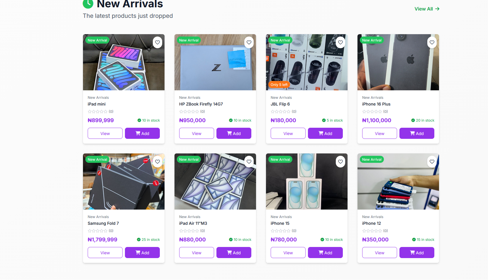
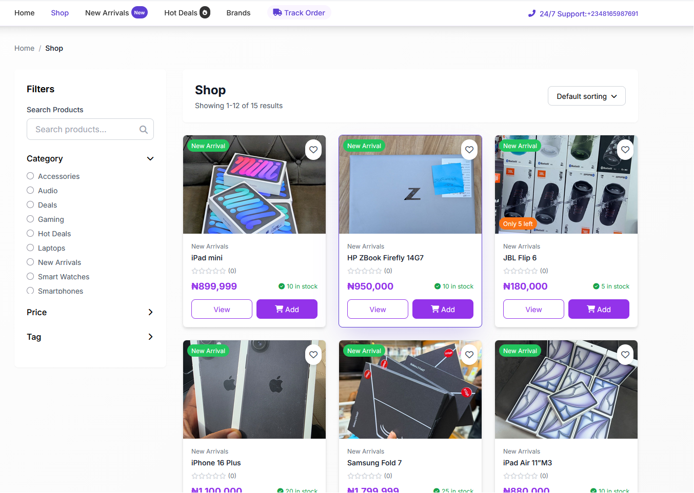
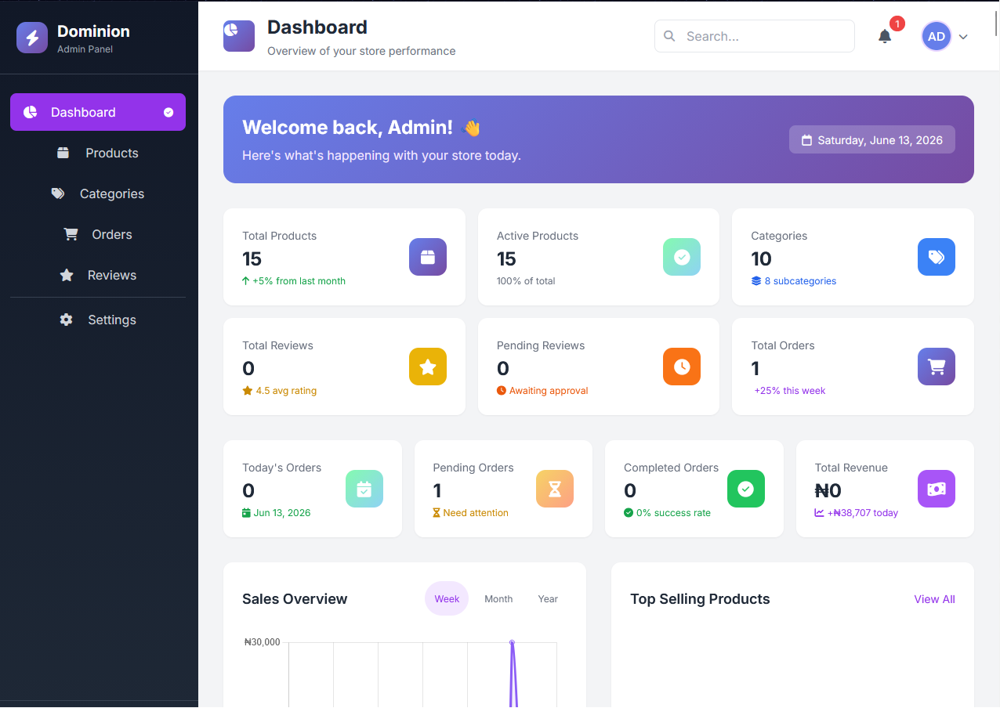

#  Phone & Gadget - E-commerce Platform

A full-featured e-commerce platform for mobile phones, gadgets, and accessories built with Laravel.

## 🚀 Features

### Customer Features

- **Product Browsing**: Browse products by categories, search, and filter
- **Shopping Cart**: Add/remove products, update quantities
- **Checkout Process**: Complete order placement with customer details
- **Order Tracking**: Track orders via unique order number
- **WhatsApp Integration**: Direct WhatsApp chat for orders and support
- **Product Reviews**: Rate and review purchased products
- **Responsive Design**: Mobile-friendly interface

### Admin Features

- **Dashboard**: Overview of sales, orders, and statistics
- **Product Management**: CRUD operations for products with image uploads
- **Category Management**: Organize products with categories and icons
- **Order Management**:
    - View and manage orders
    - Update order status with tracking timeline
    - Update payment status and methods
    - Send WhatsApp notifications to customers
    - Generate invoices
- **User Management**: Admin authentication and authorization
- **Bulk Operations**: Bulk delete orders and products

## 📋 Requirements

- PHP >= 8.1
- MySQL >= 5.7
- Composer
- Node.js & NPM (for frontend assets)
- Laravel 10.x

## 📸 Screenshots

### Homepage

### New Arrival Page

### Shopping Page

### Admin Dashboard

